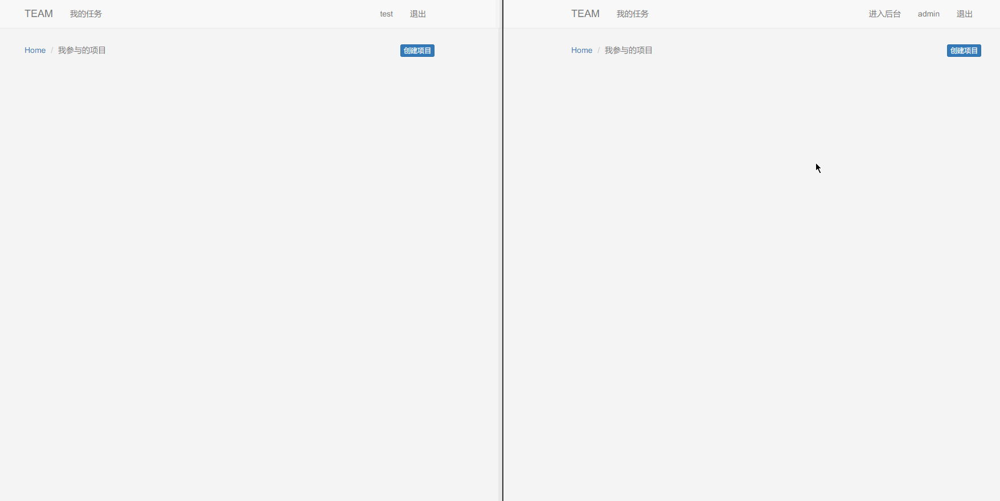
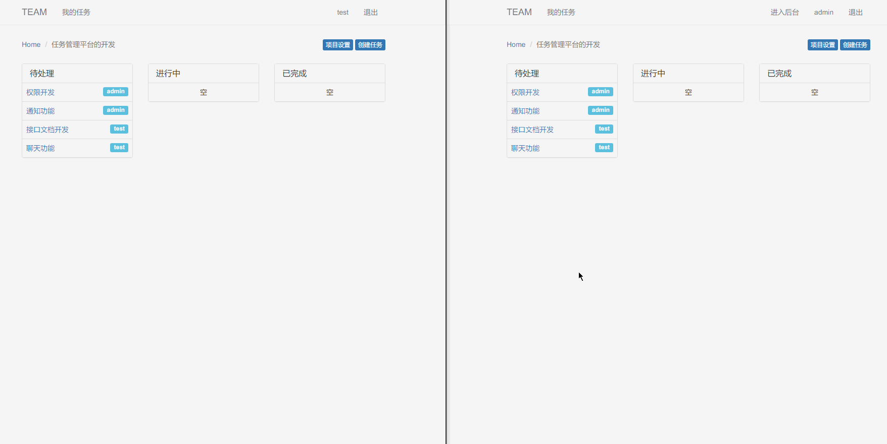
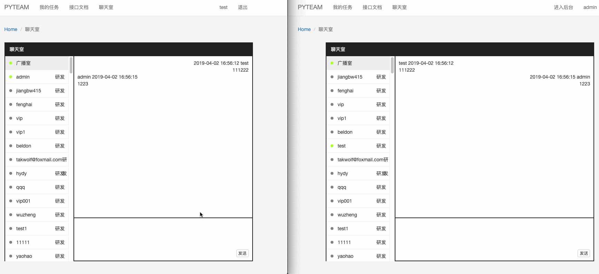

> 仿 teambition 使用 koa 开发的一个无刷新的任务管理系统，当然功能没有人家teambition多了，不过我觉得用的最多的也就这些功能了

体验地址：[https://team.yiiu.co/](https://team.yiiu.co/)

## TOC

- [TOC](#toc)
- [技术栈](#技术栈)
- [启动](#启动)
- [功能&特色](#功能特色)
- [使用场景](#使用场景)
- [使用方法](#使用方法)
- [有问题？](#有问题)
- [贡献](#贡献)
- [捐赠](#捐赠)
- [开源协议](#开源协议)

## 技术栈

- koa2
- jquery-pjax
- bootstrap3
- sequelize(mysql)
- socket.io
- nunjucks

## 启动

> 我的开发环境：nodejs(v11) + mysql(v5.7)

1. 创建数据库 `pyteam` , **不用创建表** 启动时自动就创建表了
2. 修改`config.js`里的配置信息，`base_url` 和 `mysql` 就够了

安装项目依赖

```bash
npm install
npm install -g nodemon
```

启动项目

```bash
npm run dev
```

部署正式环境

```bash
npm install -g pm2
pm2 start process.yml
```

正式环境重启

```bash
pm2 restart pyteam
```

服务端口号 3002

## 功能&特色

- 项目管理
- 项目下任务管理
- 接口文档管理

如果页面内容状态有变动，自己不用刷新页面就可以实时更新，详细可见动图







## 使用场景

内网使用，外网碰到的问题请自行解决

另外，请在 `Chrome` `Firefox` `Safari` 浏览器上使用，不要使用其它浏览器，即使是国产的套壳浏览器也不行

如果你想测试浏览器的兼容性，可以查看一下技术栈里相关技术的浏览器兼容性

## 使用方法

项目部署好之后，注册一个用户名为admin的用户，默认admin为管理员（当然也可以自行配置管理员用户，找到`config.js`文件，在数组`admins`里添加用户名即可），可以进入后台

进入后台之后，首先添加部门

其它用户注册就可以选择自己是哪个部门的了，这样在登录之后就可以看见自己部门下的所有项目了，如果不选择部门的话，是没办法创建项目的，首页也不会有任何项目

## 有问题？

- 提 issue
- 到 [开发俱乐部](https://17dev.club/) 提问

**如果有好的建议，请不要犹豫，直接发issue**

## 贡献

欢迎各种形式的PR

## 捐赠

如果感觉不错，欢迎star，不差钱的话，也可以请朋也喝杯咖啡 : )


[捐赠列表](https://github.com/tomoya92/pyteam/wiki/%E6%8D%90%E8%B5%A0%E5%88%97%E8%A1%A8)

## 开源协议

GNU AGPLv3
